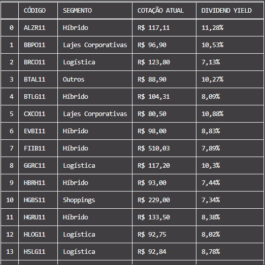

# 👨‍💻 Fundamentus WebScraping
Fundamentus is an online system that provides financial and fundamental information on companies with shares listed on Bovespa (B3 Brazilian Stock Exchange Index). This project collects data from Real Estate Funds and applies filters that can be chosen in "main.py", then the data is treated and listed in a table with the best funds according to the strategic filter.

Running code:
<h1>
    
</h1>

Languages:
- Python

Libraries:
- Requests
- BeautifulSoup
- Tabulate
- Locale

## How to use?

To run this project, it is recommended to set up a Python virtual environment. Follow the steps below to configure it:

1. Make sure you have Python installed on your machine.
2. Clone this repository on your computer.
> git clone https://github.com/ericlbarreto/webscraping-fundamentus.git
3. Navigate to the project directory:
4. Create a virtual environment.
> python -m venv venv
5. Activate the virtual environment
>venv\Scripts\activate (WINDOWS)

> source venv/bin/activate (LINUX/macOS)
6. Installation of Dependencies:
> pip install -r requirements.txt

Run the "main" code and you will have as output a table with the best results according to your filter, if you want to change the strategic filter just change the strategy variable inside the "main.py" code.

## 📚 New learnings
- Use of the Requests library to collect HTML data from the site and use such data in a functional way for python (parsing).
- Use of BeautifulSoup to handle the html codes and be able to access them with python.
- I acquired knowledge about the Tabulate library that allows you to organize data.
- I used the Locale library to transform metrics used in the code to international standards
- Application and improvement of Object Oriented Programming (OOP)
- Application of code modularization knowledge.